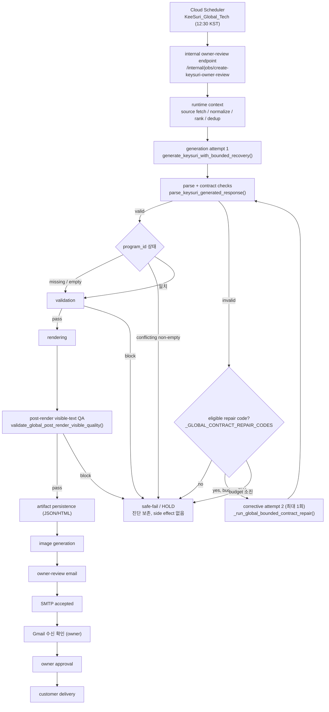

# GENIE × KeeSuri — 아키텍처 문서

> **시스템**: GENIE × KeeSuri 자동화 브리핑 파이프라인  
> **최종 갱신**: 2026-07-31 (Kee-Suri Global 생성 흐름 §추가)  
> **형식**: Mermaid 원본 + SVG + PNG (+ PDF 번들)

---

## 📁 파일 목록

| 파일명 | 형식 | 용도 |
|--------|------|------|
| `01_genie_keysuri_system_overview.mmd` | Mermaid | 전체 시스템 개요 (수정 가능 원본) |
| `01_genie_keysuri_system_overview.svg` | SVG | 시스템 개요 벡터 이미지 (검토용) |
| `01_genie_keysuri_system_overview.png` | PNG | 시스템 개요 래스터 이미지 (공유용) |
| `02_genie_keysuri_execution_sequence.mmd` | Mermaid | 실행 시퀀스 흐름도 (수정 가능 원본) |
| `02_genie_keysuri_execution_sequence.svg` | SVG | 실행 시퀀스 벡터 이미지 |
| `02_genie_keysuri_execution_sequence.png` | PNG | 실행 시퀀스 래스터 이미지 |
| `03_langchain_langgraph_langsmith_roles.mmd` | Mermaid | Lang 도구 역할 비교 (수정 가능 원본) |
| `03_langchain_langgraph_langsmith_roles.svg` | SVG | Lang 도구 역할 벡터 이미지 |
| `03_langchain_langgraph_langsmith_roles.png` | PNG | Lang 도구 역할 래스터 이미지 |
| `04_owner_review_safety_boundary.mmd` | Mermaid | 안전 경계 다이어그램 (수정 가능 원본) |
| `04_owner_review_safety_boundary.svg` | SVG | 안전 경계 벡터 이미지 |
| `04_owner_review_safety_boundary.png` | PNG | 안전 경계 래스터 이미지 |
| `architecture_bundle.pdf` | PDF | 4개 다이어그램 묶음 (인쇄/공유용) |

---

## 📊 각 다이어그램 설명

### 01. 시스템 전체 개요 (System Overview)
GENIE × KeeSuri 전체 시스템을 **5개 구역**으로 나눠 보여줍니다:
- **트리거/입력** — Cloud Scheduler → Cloud Run → Internal Jobs
- **프로그램 분기** — Today Geenee, KeeSuri Global, KeeSuri Korea
- **오케스트레이션** — Source Gate → Prompt Build → Dedup
- **생성/검증** — Gemini 호출 → 파싱 → Validation → 이미지
- **산출/발송** — GCS 저장 → Owner-Review → Approve → Customer Send
- **LangChain/LangGraph/LangSmith** 위치가 점선으로 표시됩니다.

### 02. 실행 시퀀스 (Execution Sequence)
단계별 실행 흐름을 Phase 1~8로 나누어 보여줍니다:
- 각 Phase의 주요 동작과 산출물
- **빨간색 노드** = 실패 가능 지점 (Safe-fail)
- **보라색 경계** = 승인 경계 (Approve Boundary)
- 모든 실패는 Safe-fail 영역으로 수렴 → 고객 노출 차단

### 03. LangChain / LangGraph / LangSmith 역할 비교
3개 도구의 **역할 차이**를 3열 구조로 비교합니다:
- 각 도구의 핵심 기능 목록
- **"담당하지 않는 것"** 명시
- 3자 간 관계 매핑
- GENIE × KeeSuri 시스템 내 실제 적용 위치
- 혼동 주의 사항

### 04. Owner-Review & Safety Boundary
운영 안전 경계를 **색상 구역**으로 강하게 분리합니다:
- 🟢 **안전 영역** — Validation Gates
- 🔵 **Owner-Review** — 운영자만 접근
- 🟡 **승인 경계** — approve_customer_final_send
- 🟣 **Customer Send** — 승인 후에만 가능
- 🔴 **절대 금지** — Hard Boundary (무단 발송, 설정 변경 등)

---

## 🔄 추천 검토 순서

1. **시스템 전체 개요** → 전체 구조와 레이어 파악
2. **실행 시퀀스** → 단계별 흐름과 실패 지점 이해
3. **안전 경계** → 운영 보호 메커니즘 확인
4. **LangChain/LangGraph/LangSmith 역할** → 도구별 책임 범위 이해

---

## ✏️ Mermaid 원본 수정 방법

1. `.mmd` 파일을 텍스트 에디터(VS Code 등)로 엽니다.
2. 각 파일 상단에 **수정 포인트 주석**이 있습니다 — 참고하세요.
3. VS Code에서 `Mermaid Preview` 확장을 설치하면 실시간 프리뷰가 가능합니다.
4. [Mermaid Live Editor](https://mermaid.live)에 붙여넣어 온라인으로 편집할 수도 있습니다.

### 주요 수정 시나리오:
- **새 프로그램 추가**: `01_*.mmd`의 "프로그램 분기" subgraph에 노드 추가
- **새 검증 게이트 추가**: `02_*.mmd`와 `04_*.mmd`에 노드 추가
- **LangChain 기능 추가**: `03_*.mmd`의 해당 열에 노드 추가
- **스타일 변경**: `classDef` 블록 수정 (fill, stroke, color)

---

## 🖼️ SVG / PNG 재생성 방법

### 사전 준비
```bash
# Mermaid CLI 설치 (Node.js 필요)
npm install -g @mermaid-js/mermaid-cli
```

### 개별 파일 생성
```bash
cd docs/architecture

# SVG 생성
mmdc -i 01_genie_keysuri_system_overview.mmd -o 01_genie_keysuri_system_overview.svg -b transparent
mmdc -i 02_genie_keysuri_execution_sequence.mmd -o 02_genie_keysuri_execution_sequence.svg -b transparent
mmdc -i 03_langchain_langgraph_langsmith_roles.mmd -o 03_langchain_langgraph_langsmith_roles.svg -b transparent
mmdc -i 04_owner_review_safety_boundary.mmd -o 04_owner_review_safety_boundary.svg -b transparent

# PNG 생성 (가로 1600px 이상)
mmdc -i 01_genie_keysuri_system_overview.mmd -o 01_genie_keysuri_system_overview.png -w 2400 -b white
mmdc -i 02_genie_keysuri_execution_sequence.mmd -o 02_genie_keysuri_execution_sequence.png -w 2400 -b white
mmdc -i 03_langchain_langgraph_langsmith_roles.mmd -o 03_langchain_langgraph_langsmith_roles.png -w 2400 -b white
mmdc -i 04_owner_review_safety_boundary.mmd -o 04_owner_review_safety_boundary.png -w 2400 -b white
```

### 일괄 생성 스크립트
```bash
#!/bin/bash
cd docs/architecture
for f in *.mmd; do
  base="${f%.mmd}"
  echo "▶ Processing: $base"
  mmdc -i "$f" -o "${base}.svg" -b transparent
  mmdc -i "$f" -o "${base}.png" -w 2400 -b white
done
echo "✅ Done"
```

---

## 📄 PDF 생성 방법

### 방법 1: 이미지 → PDF 변환 (권장)
```bash
# ImageMagick 사용
convert \
  01_genie_keysuri_system_overview.png \
  02_genie_keysuri_execution_sequence.png \
  04_owner_review_safety_boundary.png \
  03_langchain_langgraph_langsmith_roles.png \
  architecture_bundle.pdf
```

### 방법 2: Puppeteer + Mermaid CLI
```bash
# 각각 PDF로 내보낸 뒤 합치기
mmdc -i 01_genie_keysuri_system_overview.mmd -o 01.pdf -b white
mmdc -i 02_genie_keysuri_execution_sequence.mmd -o 02.pdf -b white
mmdc -i 04_owner_review_safety_boundary.mmd -o 04.pdf -b white
mmdc -i 03_langchain_langgraph_langsmith_roles.mmd -o 03.pdf -b white

# pdfunite (poppler-utils)로 합치기
pdfunite 01.pdf 02.pdf 04.pdf 03.pdf architecture_bundle.pdf
rm 01.pdf 02.pdf 03.pdf 04.pdf
```

### 방법 3: 브라우저에서 인쇄
1. SVG 파일을 브라우저에서 열기
2. `Ctrl+P` / `Cmd+P` → "PDF로 저장"
3. 4개 파일 합치기

---

## ⚠️ 주의 사항

### Mermaid 렌더링 환경
- **mmdc** (Mermaid CLI)는 내부적으로 Puppeteer + Chromium을 사용합니다.
- 첫 실행 시 Chromium 다운로드에 시간이 걸릴 수 있습니다.
- CI/CD 환경에서는 `--puppeteerConfigFile` 옵션으로 Chromium 경로를 지정하세요.

### 한글 폰트
- SVG/PNG 렌더링 시 한글 폰트가 설치되어 있어야 합니다.
- macOS: 기본 한글 폰트 사용 가능
- Linux: `fonts-noto-cjk` 패키지 설치 필요
- Docker: `apt-get install -y fonts-noto-cjk` 추가

### 이모지 지원
- 다이어그램에 이모지(🔹, ❌, 🛑 등)를 사용합니다.
- 이모지 렌더링이 깨지는 환경에서는 `.mmd` 파일에서 이모지를 제거하거나 텍스트로 대체하세요.

### 파일 크기
- PNG 파일은 2400px 가로 기준으로 생성됩니다.
- 복잡한 다이어그램의 경우 파일 크기가 클 수 있습니다.
- 가로 크기를 조절하려면 `-w` 옵션 값을 변경하세요.

---

## 🏗️ 파일 구조

```
docs/architecture/
├── 01_genie_keysuri_system_overview.mmd      ← Mermaid 원본
├── 01_genie_keysuri_system_overview.svg      ← SVG (벡터)
├── 01_genie_keysuri_system_overview.png      ← PNG (래스터)
├── 02_genie_keysuri_execution_sequence.mmd
├── 02_genie_keysuri_execution_sequence.svg
├── 02_genie_keysuri_execution_sequence.png
├── 03_langchain_langgraph_langsmith_roles.mmd
├── 03_langchain_langgraph_langsmith_roles.svg
├── 03_langchain_langgraph_langsmith_roles.png
├── 04_owner_review_safety_boundary.mmd
├── 04_owner_review_safety_boundary.svg
├── 04_owner_review_safety_boundary.png
├── architecture_bundle.pdf                   ← 4개 묶음 PDF
└── README.md                                 ← 이 파일
```

---

## 📌 현재 운영 기준선 (Current Operational Baseline)

* **최근 성공 기록**: latest Korea PASS run_id
* **배포 상태**: current deployed revision
* **운영-고객 경계 (Owner-Review/Customer-Send Boundary)**:
  * `customer_delivery_status=not_sent`
  * `approve_customer_final_send=false`

---

## 🛡️ 장애 복구 레이어 (Defect Recovery Layers)

시스템은 다양한 실패 시나리오에 대한 복구 및 방어 메커니즘을 포함합니다:
* **DEDUP_OVERBLOCK_DEFECT 방어**: candidate pool expansion 및 exposure_dedup_backfill_used 활용
* **MISSING_DIAGNOSTICS 추적**: `candidate_funnel_summary`를 통해 후보 뉴스 탈락 원인 진단
* **Gemini 파싱/포맷 오류 복구**: 
  * `LLM_OUTPUT_CONTRACT_REPAIR_GAP` 인지
  * `deep_dive.key_implications` deterministic repair (결정론적 복구) 적용 (`keysuri_deep_dive_key_implications_repaired`)
* **최종 품질 방어**: internal marker (내부 마커)가 포함된 visible HTML 노출 금지

---

## 🚀 현재 구현 vs 미래 LangGraph 전환안

* **현재 구현 (Current Implementation)**:
  * 순수 Python 로직 제어 (`Python` / `FastAPI` / `service_full_run`)
  * `prompt_input` → `validation` → `Gemini` → `parser` → `artifact` → `SMTP` → `admin approve` 흐름
* **LangChain 도입 후보**:
  * prompt template, model wrapper, structured output, tool abstraction
* **LangGraph 도입 후보**:
  * state machine, node graph, retry/safe-fail/resume 처리의 표준화
* **LangSmith 도입 후보**:
  * tracing, observability, eval, regression tracking 기능 적용

---

## Kee-Suri Global 생성 흐름 및 안전 게이트 (2026-07-31)

Kee-Suri Global 자연실행의 컴포넌트·데이터 흐름과 safe-fail 게이트.
불변 조건은 `docs/CURRENT_STATUS_SNAPSHOT.md` §9, 검증 절차는 `ROLLOUT.md` §7,
사건 근거는
[KEYSURI_GLOBAL_RECURRENCE_PREVENTION_CLOSEOUT_2026_07_31.md](../keysuri/KEYSURI_GLOBAL_RECURRENCE_PREVENTION_CLOSEOUT_2026_07_31.md).



### 안전 게이트 및 금지 부작용

| 게이트 | 통과 실패 시 |
|--------|--------------|
| parse / contract | eligible 코드면 corrective 1회, 아니면 safe-fail |
| generation budget | **총 2회 초과 호출 금지**. 소진 시 safe-fail |
| `program_id` 충돌 | hard block — 보정·재시도 없음 |
| validation | block 시 image / email 미도달 |
| post-render visible-text QA | block 시 email 미도달 |
| owner approval | 승인 전 customer delivery 절대 불가 |

safe-fail 은 **image 및 email side effect 이전에** 발생하며 진단을 보존한다.

### 컨트롤 데이터가 생성되는 위치

| 데이터 | 생성 위치 |
|--------|-----------|
| sanitized model-output snapshot | `keysuri_generation_prompt.sanitized_model_output_snapshot()` — parse/schema 실패 반환 경로 |
| generation contract fingerprint | `keysuri_generation_prompt.generation_contract_record()` — 시도별 |
| primary/secondary failure 분류 | `keysuri_generation_prompt.classify_failure_priority()` |
| post-render QA 진단 | `_post_render_qa_diagnostic_fields()` → 실패 artifact |
| recurrence counters | `keysuri_recurrence_metrics.recurrence_counters_for_run()` — 저장된 진단에서 파생 (read-only) |
